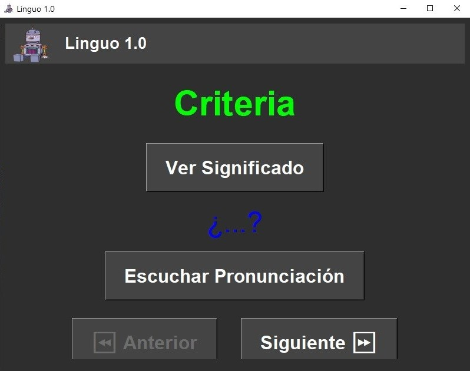
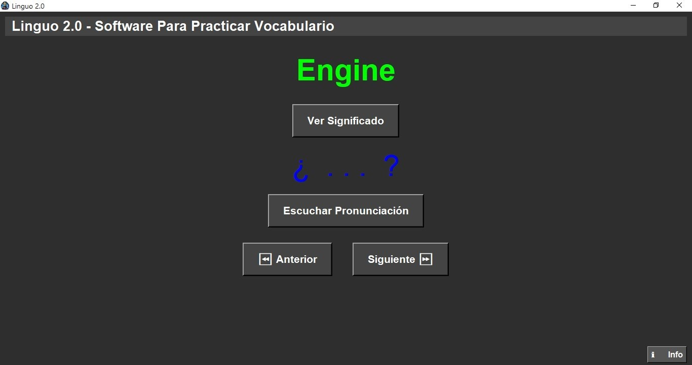
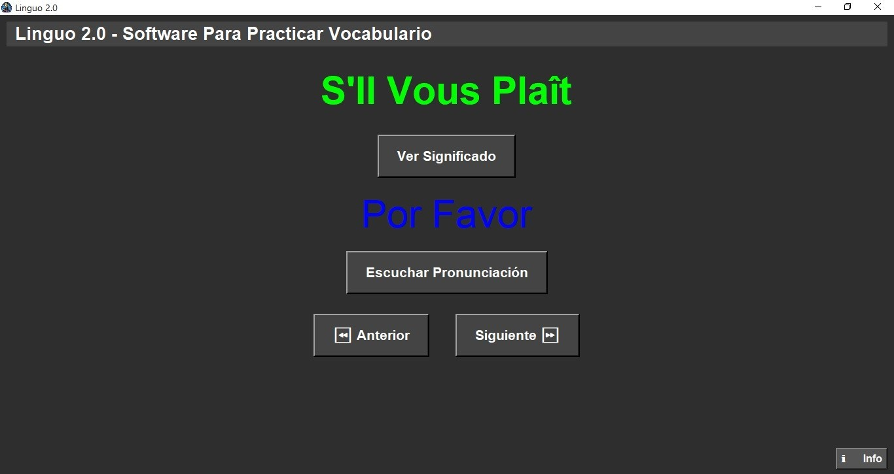
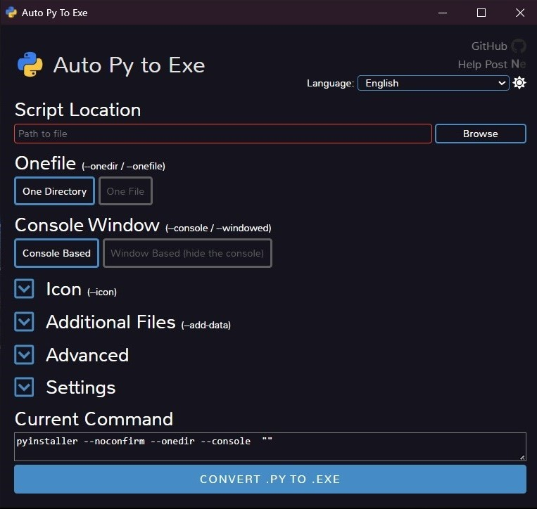

# Linguo - En Construcción

Este proyecto es ideal para quienes buscan mejorar su vocabulario en inglés de manera interactiva y práctica, combinando la generación automática de audios con una aplicación gráfica intuitiva. Con pocas modificaciones se puede usar para otros idiomas.

# Índice

* [Linguo 1.0](#Linguo-1.0) 
* [Linguo 2.0](#Linguo-2.0) 
* [Linguo 2.0 Francés](#Linguo-2.0-Francés) 
* [Programa para Windows](#Programa-para-Windows) 
  * [Archivos exe](#Archivos-exe) 
* [Como utilizar Linguo](#Como-utilizar-Linguo) 
* [Autor](#Autor)

# Linguo 1.0

Este proyecto contiene dos programas principales. El primer código genera archivos de audio para cada palabra en un archivo CSV de vocabulario, utilizando la biblioteca gTTS para sintetizar la pronunciación en inglés. Además, limpia y capitaliza el contenido del archivo CSV antes de generar los audios en formato MP3. Cada archivo de audio se guarda en la carpeta "audio", asegurando que los nombres sean compatibles eliminando caracteres no alfanuméricos y reemplazando espacios con guiones bajos. Para ello, se utiliza la función limpiar_nombre, que elimina caracteres especiales y formatea los nombres de archivo. 

El segundo código implementa una interfaz gráfica con Tkinter para facilitar el aprendizaje de vocabulario en inglés. Permite visualizar palabras en inglés, revelar su traducción al español y reproducir su pronunciación. La aplicación carga el vocabulario desde un archivo CSV utilizando la función cargar_diccionario, que almacena las palabras y sus traducciones en una lista de tuplas. La interfaz se adapta dinámicamente al tamaño de la ventana gracias a la función ajustar_tamanio, que modifica la fuente y el espaciado de los elementos en función del tamaño de la ventana. 

También se incluyen funciones para navegar entre palabras (siguiente_palabra y anterior_palabra), mostrar la traducción (mostrar_traduccion) y reproducir el audio (pronunciar), verificando previamente si el archivo de audio existe. Además, se ha añadido soporte para mostrar un icono en la interfaz y manejar eventos de redimensionamiento.

 [Volver al Índice](#Índice)

# Linguo 2.0

Los cambios en esta nueva versión del código incluyen:

- Integración de pygame.mixer para la reproducción interna de archivos MP3, eliminando la necesidad de un reproductor externo.

- Nuevo botón de información (mostrar_info), que muestra detalles sobre la aplicación y su funcionamiento en una ventana emergente.

- Mejoras en la interfaz, incluyendo una barra de título con un icono personalizado y un diseño optimizado para mejorar la experiencia del usuario.

 [Volver al Índice](#Índice)

# Linguo 2.0-Francés

Principales modificaciones:

- Soporte para francés 🇫🇷: Ahora el sistema genera archivos de audio en francés gracias a gTTS, permitiendo el aprendizaje de este idioma con una correcta pronunciación.

- Compatibilidad con caracteres especiales: Se ha mejorado la carga y procesamiento del archivo CSV para asegurar que palabras con acentos y caracteres propios del francés sean correctamente reconocidas y guardadas.

 [Volver al Índice](#Índice)

# Programa para Windows

Para convertir el código de Python en un archivo ejecutable (.exe), utilizó auto-py-to-exe, que da una interfaz amigable de pyinstaller. 

Es necesario instalar auto-py-to-exe ejecutando pip install auto-py-to-exe, para ejecutar el programa se ejecuta auto-py-to-exe en un command promt.

Luego de esto abre una interfaz gráfica donde podemos configurar opciones como incluir archivos adicionales, ocultar la consola y generar un solo archivo .exe. Una vez configurado, presionamos Convert .py to .exe y el ejecutable se generará en la carpeta output. Esto facilita la distribución del programa sin necesidad de que el usuario tenga Python instalado. 

 [Volver al Índice](#Índice)

## Archivos exe

Archivos .exe para correr el programa en windows sin instalar python,ni las librerías utilizadas.

- [Linguo 2.0 Ingles](https://drive.google.com/file/d/1ug1SxR05lRF4IgcpCQVY71AshzoJzce6/view?usp=sharing)
- [Linguo 2.0 Frances](https://drive.google.com/file/d/1ver1IoIyiuBUS7QKLr6_GC2dKF5RlS1j/view?usp=sharing)

# Como utilizar Linguo

## Listas de directorios y archivos
- Carpeta logo -> Donde se guardan las imagenes del los programas.
- Carpeta audio -> Donde se guardan los archivos de audio.
- Vocabulario.csv -> Guarda la lista de vocabulario columna1 palabra, columna2 traducción.
- Linguo 2.0_audios.exe -> Permite genera los archivos .mp3
- Linguo 2.0.exe -> Permite ejecutar el programa. 

1.- Se debe verificar el archivo **vocabulario.csv**, modificando ese archivo se puede agregar o quitar el vocabulario que usa el programa, se coloca la palabra o frase en ingles y en español.

2.- Cada vez que se modifiqué el archivo **vocamulario.csv** se debe correr **audio.exe**, para el idioma adecuado, eso genera y guarda los archivos .mp3 dentro de la **carpeta audio**.

3.- Ya se puede utilizar el programa ejecutando **linguo2.0.exe** 

 [Volver al Índice](#Índice)

# Autor

José R. Guignan
- Mail: joserguignan@gmail.com
- Linkedin: [https://www.linkedin.com/in/jrguignan/](https://www.linkedin.com/in/jrguignan)
- Portafolio: [https://jrguignan.github.io/](https://jrguignan.github.io/)
